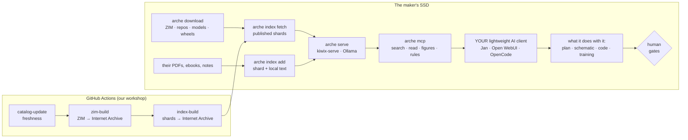

# MVP — architecture of the shortest path

> An MVP is designed by subtraction. This document says what Arche must do end to end in order to
> exist, what is already there, what is missing, and in what order. Figures come from the real
> catalogue on 11 September 2026. Grounded in ADR 0013 (the base, not the software), with ADR 0007,
> 0010, 0011, 0012 re-read in its light. Français : [MVP.md](../fr/MVP.md)

## The product, in one sentence

**A knowledge base for self-reliance and survival — hundreds of reference corpora, indexed and
hosted on Internet Archive, plus whatever the user adds — served over MCP to any lightweight model
running offline, so that after a complete blackout someone can do, with all the diversity, what we
do today with the network: search, compute, design, train, rebuild the technology from scratch.**

We do not build software. Arche's software is limited to what *serves* the base with no network:
catalogue, download, serve, index, search, expose. The garden, the robot, the house, the tractor,
the farm are five generic examples among millions — they show the shape, they bound nothing.

## The critical path



And the journey of one question — the heart is unchanged, but Arche is only a server in it:

```mermaid
sequenceDiagram
  participant U as Maker
  participant C as Lightweight AI client (Qwen3.5 4B–9B)
  participant M as arche mcp
  U->>C: "with what I have, how do I do X?"
  C->>M: search(question) — ZIMs' Xapian + dense shards + personal documents
  M-->>C: sourced passages [1] [2] [3], Kiwix link or local text; instruction on top if sensitive
  C->>M: resources/read arche://knowledge/figures.yaml (the figures, not memory)
  C->>M: estimate_pipeline — how long, how many Wh, here
  C-->>U: a cited answer, a plan, or code it writes itself from the base
```

## What already exists (and is tested)

The end-to-end indexing chain: extraction (ZIM via zimdump, PDF via pdftotext, hand-read EPUB,
Markdown, HTML, folders), chunking, embedding **resumable after an outage**, shard + local text,
`arche index build | add | list | fetch | estimate`, the `index-build.yml` workflow and the plan of
120 text corpora (`catalog/index-plan.yaml`). Three-channel hybrid retrieval: each ZIM's Xapian,
dense shards, local BM25 over the user's documents — each optional, none hidden. The MCP server
(stdio and HTTP), 21 tools, resources and prompts. The catalogue (317 resources, 24 bundles
including `training` and `automation`), the planner, resumable download, `arche serve` without a
daemon, USB export. The time **and energy** estimator, the job queue. The knowledge files: figures,
crops, compute, five example recipes. The example solvers. The workflows — written, never run. 136
tests.

## What is missing on the critical path

**G1 — Exist.** Repository on GitHub, `ci.yml` green, `catalog-update.yml` run once, Internet
Archive account (D11). Zero code. *Done when* `arche catalog freshness` reports a non-zero figure.

**G2 — The first published shards.** `index-build.yml` on the twenty smallest corpora of the plan
(poison centres, toxic plants, Sphere, first aid, water…): ~2 GB of text, one day of CI. *Done
when* `arche index fetch` installs twenty fusable shards on a blank machine and `search` answers on
all three channels.

**G3 — `arche eval`.** Runs `knowledge/eval.yaml` against the installed shards: recall@5, guard
rails rightly returned, channels that answered. Without it, "it works" is an opinion. ~120 lines —
the MVP's last piece of software.

**G4 — A real lightweight client.** Jan or Open WebUI on `arche mcp`, Qwen3.5 4B, on an 8 GB
machine. *Done when* an eval question gets a cited answer in a client we did not write, and "how
long and how many Wh for that?" gets a figure.

**G5 — The big corpora.** Wikipedia FR (13 GB, ~4.5 million chunks) does not fit a GitHub runner: a
self-hosted GPU runner, or batching with cache — ADR 0012 has the mechanics, the machine is
missing. After the MVP, but on the road to "hundreds of RAGs".

**G6 — The knowledge of methods.** `knowledge/methods/`: how to plan with the base, derive a design,
train on your own logs, estimate without fooling yourself, and the reading order for "rebuilding the
technology from scratch". Writing, not code; it is what makes a 4-billion model able to do what a
solver did.

**G7 — The object.** The Self-reliant Edition (novice + the examples' corpus + `training` +
`automation`, ~100 GB) as a frozen `arche.yaml`, `arche export` to a 128 GB SSD, sheets as PDF.
*Done when* an SSD prepared online searches, computes and estimates offline.

## The order

M0 = G1, this week, no code. M1 = G2 + G3: the first measured shards — that is where the product
becomes real. M2 = G4: a real lightweight client. M3 = G7 + G6: the object, and the knowledge that
goes with it. G5 in parallel as soon as a GPU machine exists. Ten focused days; the rest is writing
knowledge, which has no end and is the real work.

## The decisions that block

**D6** the repository name and URL (M0). **D11** the Internet Archive account (M1). **D21 — the GPU
machine for the big corpora**: a self-hosted runner at someone trusted, a one-off rental, or waiting
— without it, Wikipedia stays searchable through Xapian alone (which already works) and has no dense
channel. **D20** the scope of the Self-reliant Edition, revised to ~100 GB with `training` and
`automation`.

## What the MVP does not claim

It has no client and will not have one. It does not guarantee what the model does with its
passages; it guarantees that its passages have a source, its figures a computation, its estimates a
stated uncertainty. It trains nothing in the user's place: it gives the tools, the wheels and — soon
— the method. It replaces nobody on the three sensitive subjects, nor on a beam, nor on a motor: the
human gates are in the base, and a client that reads them cites them.
