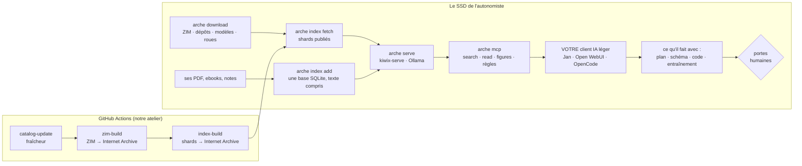

# MVP — l'architecture du plus court chemin

> Un MVP se conçoit par soustraction. Ce document dit ce qu'Arche doit faire de bout en bout pour
> exister, ce qui est déjà là, ce qui manque, et dans quel ordre. Chiffres tirés du catalogue réel au
> 11 septembre 2026. Fondé sur l'ADR 0013 (la base, pas le logiciel), et sur les ADR 0007, 0010,
> 0011, 0012 relus à sa lumière. English: [MVP.md](../en/MVP.md)

## Le produit, en une phrase

**Une base de connaissance de l'autonomie et de la survie — des centaines de corpus de référence
indexés et hébergés sur Internet Archive, plus ce que l'utilisateur y ajoute — servie par MCP à
n'importe quel modèle léger tournant hors ligne, pour qu'après un blackout complet quelqu'un puisse
faire avec toute la diversité ce qu'on fait aujourd'hui avec le réseau : chercher, calculer,
concevoir, entraîner, reproduire la technologie depuis zéro.**

On ne crée pas de logiciel. Le logiciel d'Arche se limite à ce qui *sert* la base sans réseau :
cataloguer, télécharger, servir, indexer, chercher, exposer. Le potager, le robot, la maison, le
tracteur, l'exploitation sont cinq exemples génériques parmi des millions — ils montrent la forme,
ils ne bornent rien.

## Le chemin critique



Et le trajet d'une question — le cœur reste le même, mais Arche n'y est qu'un serveur :

```mermaid
sequenceDiagram
  participant U as Autonomiste
  participant C as Client IA léger (Qwen3.5 4B–9B)
  participant M as arche mcp
  U->>C: « avec ce que j'ai, comment je fais X ? »
  C->>M: search(question) — Xapian des ZIM + corpus SQLite (FTS5 + vecteurs), documents perso compris
  M-->>C: extraits [1] [2] [3] sourcés, lien Kiwix ou arche://article ; consigne en tête si sensible
  C->>M: resources/read arche://knowledge/figures.yaml (les chiffres, pas de mémoire)
  C->>M: estimate_pipeline — combien de temps, combien de Wh, ici
  C-->>U: réponse citée, plan, ou code qu'il écrit lui-même à partir de la base
```

## Ce qui existe déjà (et se teste)

La chaîne d'indexation de bout en bout : extraction (ZIM via zimdump, PDF via pdftotext, EPUB lu à
la main, Markdown, HTML, dossiers), découpage, écriture **dans une base SQLite par corpus** (texte,
FTS5, vecteurs int8 par modèle, licence héritée — ADR 0014, M1-2) **reprenable après coupure**,
`arche index build | add | list | fetch | estimate`, le workflow `index-build.yml` et le plan de
120 corpus texte (`catalog/index-plan.yaml`). La recherche hybride (M1-3) : Xapian de chaque ZIM et
un canal `sqlite` par corpus installé — FTS5 et cosinus sur la table du modèle, fusion RRF — chacun
optionnel, aucun caché ; `read_article` lit `articles`/`chunks`. Plus de `.arche-idx`, plus de
parseur maison. Le serveur MCP (stdio et HTTP), 21 outils, ressources et prompts. Le
catalogue (317 ressources, 24 paquets dont `training` et `automation`), le planificateur, le
téléchargement avec reprise, `arche serve` sans démon, l'export USB. L'estimateur de temps **et
d'énergie**, la file de tâches. Les fichiers de connaissance : chiffres, cultures, calcul, cinq
recettes-exemples. Les solveurs-exemples. Les workflows — écrits, jamais exécutés. 136 tests.

## Ce qui manque sur le chemin critique

**G1 — Exister.** Dépôt sur GitHub, `ci.yml` vert, `catalog-update.yml` exécuté une fois, compte
Internet Archive (D11). Zéro code. *Fini quand* `arche catalog freshness` rend un chiffre non nul.

**G2 — Les premiers shards publiés.** `index-build.yml` sur les vingt plus petits corpus du plan
(centres antipoison, plantes toxiques, Sphère, premiers secours, eau…) : ~2 Go de texte, une
journée de CI. *Fini quand* `arche index fetch` installe vingt shards fusionnables sur une machine
vierge et que `search` répond sur les deux canaux (`xapian`, `sqlite`).

**G3 — `arche eval`.** Fait tourner `knowledge/eval.yaml` contre les shards installés : rappel@5,
garde-fous rendus à raison, canaux qui ont répondu. Sans ça, « ça marche » est une opinion. ~120
lignes — le dernier morceau de logiciel du MVP. **Écrit (M1-7)** : rappel@5 et MRR par canal
(xapian / sqlite / fusion / rerank), par corpus, par sujet ; mots obligatoires ; garde-fous ;
négatives ; tableau publié dans [EVAL.md](EVAL.md) ; seuil bloquant en CI sur le corpus fixture
(nos docs). *Fini pour de vrai quand* il tourne sur les vingt shards de G2.

**G4 — Un client léger, réel.** Jan ou Open WebUI branché sur `arche mcp`, Qwen3.5 4B, sur une
machine à 8 Go. *Fini quand* une question de l'eval obtient une réponse citée dans un client que
nous n'avons pas écrit, et que « combien de temps et de Wh pour ça ? » obtient un chiffre.

**G5 — Les gros corpus.** Wikipédia FR (13 Go, ~4,5 millions de chunks) ne passe pas dans un
runner GitHub : un runner GPU auto-hébergé, ou le découpage en lots avec cache — l'ADR 0012 a la
mécanique, il manque la machine. Après le MVP, mais sur le chemin de « des centaines de RAG ».

**G6 — La connaissance des méthodes.** `knowledge/methods/` : comment planifier avec la base,
dériver un design, entraîner sur ses relevés, estimer sans se mentir, et l'ordre de lecture pour
« reproduire la technologie depuis zéro ». C'est de l'écriture, pas du code ; c'est ce qui rend un
modèle de 4 milliards capable de faire ce qu'un solveur faisait.

**G7 — L'objet.** L'Édition Autonomiste (novice + corpus des exemples + `training` + `automation`,
~100 Go) comme `arche.yaml` figé, `arche export` vers un SSD de 128 Go, fiches en PDF. *Fini
quand* un SSD préparé en ligne cherche, calcule et estime hors ligne.

## L'ordre

M0 = G1, cette semaine, sans code. M1 = G2 + G3 : les premiers shards mesurés — c'est là que le
produit devient vrai. M2 = G4 : un client léger réel. M3 = G7 + G6 : l'objet, et la connaissance
qui va avec. G5 en parallèle dès qu'une machine GPU existe. Dix jours concentrés ; le reste est de
l'écriture de connaissance, qui n'a pas de fin et qui est le vrai travail.

## Les décisions qui bloquent

**D6** le nom et l'URL du dépôt (M0). **D11** le compte Internet Archive (M1). **D21 — la machine
GPU pour les gros corpus** : un runner auto-hébergé chez quelqu'un de confiance, une location
ponctuelle, ou attendre — sans elle, Wikipédia reste cherchable par Xapian seul (ce qui marche
déjà) et n'a pas de canal dense. **D20** le périmètre de l'Édition Autonomiste, revu à ~100 Go
avec `training` et `automation`.

## Ce que le MVP ne prétend pas

Il n'a pas de client et n'en aura pas. Il ne garantit pas ce que le modèle fait de ses extraits ;
il garantit que ses extraits ont une source, que ses chiffres ont un calcul, que ses estimations
disent leur incertitude. Il n'entraîne rien à la place de l'utilisateur : il lui donne les outils,
les roues et — bientôt — la méthode. Il ne remplace personne sur les trois sujets sensibles, ni sur
une poutre, ni sur un moteur : les portes humaines sont dans la base, et un client qui les lit les
cite.
